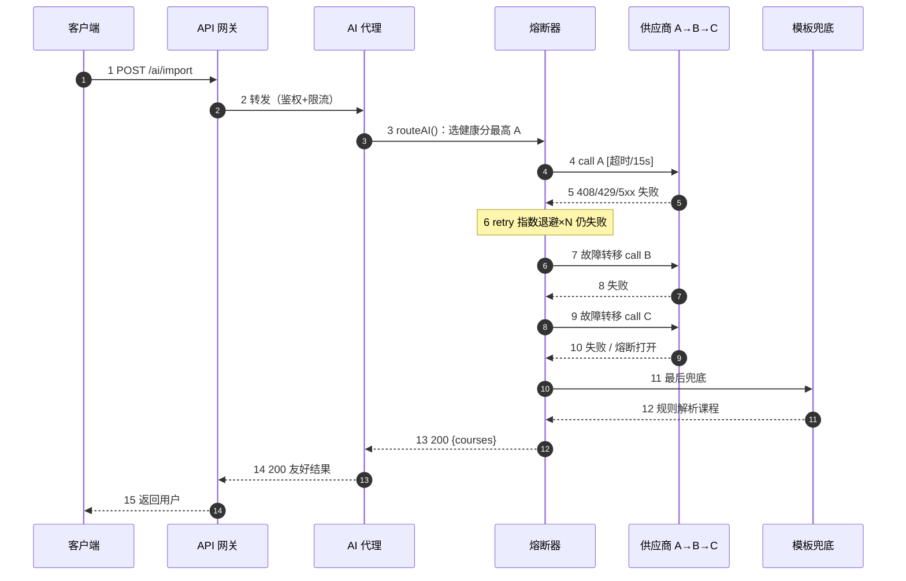

# AI 导入故障转移时序图

> 来源：`AI 导入故障转移时序.svg`
> 说明：客户端经网关到 AI 代理，熔断器依次尝试供应商 A / B / C，均失败时走模板兜底，全程含重试、超时与熔断；任一层失败自动降级，最终绝不抛给用户崩溃。

## 参与方（生命周期）

| 序号 | 角色 | 说明 |
| --- | --- | --- |
| 1 | 客户端 | 发起导入请求 |
| 2 | API 网关 | 鉴权、限流、路由转发 |
| 3 | AI 代理 | 调用 `routeAI()` 选择供应商 |
| 4 | 熔断器 | 重试、超时、故障转移、熔断 |
| 5 | 供应商 A→B→C | 依次尝试的外部 / 本地模型 |
| 6 | 模板兜底 | 全部失败后的规则解析兜底 |

## 时序图（Mermaid）

## 消息流说明

| 步骤 | 方向 | 内容 |
| --- | --- | --- |
| 1 | 客户端 → API 网关 | `POST /ai/import` |
| 2 | API 网关 → AI 代理 | 转发（鉴权 + 限流） |
| 3 | AI 代理 → 熔断器 | `routeAI()`：选健康分最高 A |
| 4 | 熔断器 → 供应商 | `call A` [超时 / 15s] |
| 5 | 供应商 → 熔断器 | 408 / 429 / 5xx 失败 |
| 6 | 熔断器（自环） | retry 指数退避 ×N 仍失败 |
| 7 | 熔断器 → 供应商 | 故障转移 `call B` |
| 8 | 供应商 → 熔断器 | 失败 |
| 9 | 熔断器 → 供应商 | 故障转移 `call C` |
| 10 | 供应商 → 熔断器 | 失败 / 熔断打开 |
| 11 | 熔断器 → 模板兜底 | 最后兜底 |
| 12 | 模板兜底 → 熔断器 | 规则解析课程 |
| 13 | 熔断器 → AI 代理 | `200 {courses}` |
| 14 | AI 代理 → API 网关 | `200` 友好结果 |
| 15 | API 网关 → 客户端 | 返回用户 |

## 关键设计点

- **重试与退避**：对供应商 A 先执行指数退避重试，仍失败才进入故障转移。
- **逐级故障转移**：A → B → C 依次尝试，避免单点供应商不可用导致整体失败。
- **熔断短路**：熔断打开时，后续供应商调用被短路，直接跳至「模板兜底」，不浪费连接资源。
- **最终兜底**：模板解析兜底保证即使所有 AI 供应商均不可用，导入功能仍能返回友好结果，绝不向用户抛出崩溃。
