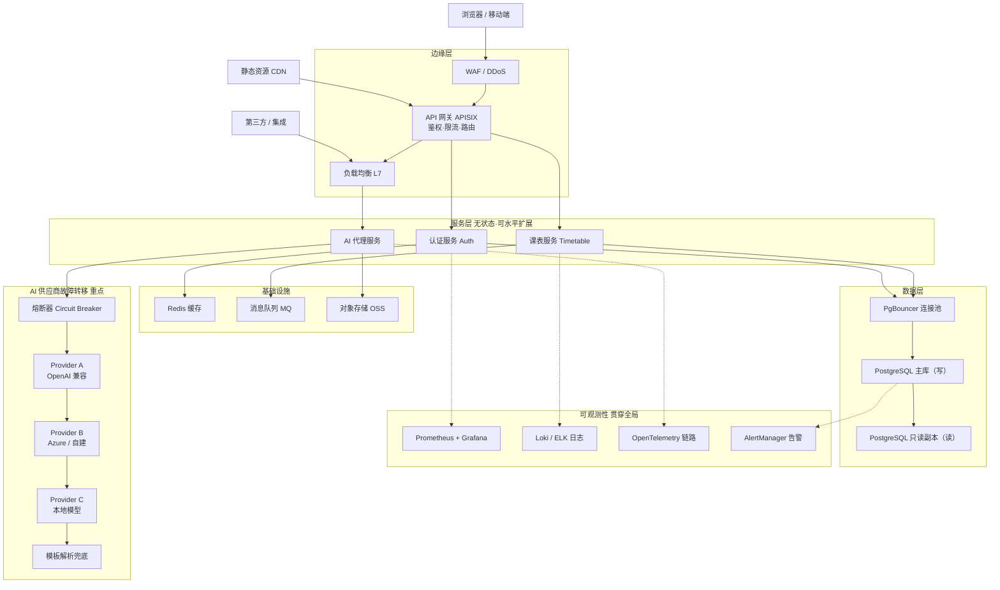

# 智能课程表 Pro 后端分层架构图

> 来源：`后端分层架构图.svg`
> 说明：客户端经边缘层（WAF / API 网关 / 负载均衡）进入无状态服务层，经基础设施（Redis / MQ / 对象存储）与数据层（PostgreSQL 主从），AI 代理通过熔断器串联多供应商并故障转移至模板兜底；可观测性贯穿全局。

## 分层结构

| 层级 | 组件 |
| --- | --- |
| **客户端** | 浏览器 / 移动端、静态资源 CDN、第三方 / 集成 |
| **边缘层** | WAF / DDoS、API 网关 APISIX（鉴权 · 限流 · 路由）、负载均衡 L7 |
| **服务层（无状态·可水平扩展）** | 认证服务 Auth、课表服务 Timetable、AI 代理服务 |
| **基础设施** | Redis 缓存、消息队列 MQ、对象存储 OSS |
| **数据层** | PgBouncer 连接池、PostgreSQL 主库（写）、PostgreSQL 只读副本（读） |
| **可观测性** | Prometheus + Grafana、Loki / ELK 日志、OpenTelemetry 链路、AlertManager 告警 |
| **AI 供应商故障转移（重点）** | 熔断器 Circuit Breaker → Provider A（OpenAI 兼容）→ Provider B（Azure / 自建）→ Provider C（本地模型）→ 模板解析兜底（失败逐级故障转移） |

## 架构图（Mermaid）



## 故障转移链路（AI 重点区域）

```
熔断器 Circuit Breaker
        │ 失败则降级
        ▼
Provider A (OpenAI 兼容)
        │ 失败则降级
        ▼
Provider B (Azure / 自建)
        │ 失败则降级
        ▼
Provider C (本地模型)
        │ 失败 / 熔断打开
        ▼
模板解析兜底   ← 失败逐级故障转移，最终绝不抛给用户崩溃
```

## 依赖关系要点

- **入口收敛**：三类客户端流量统一经 WAF → API 网关（鉴权/限流/路由）→ 负载均衡 进入服务层。
- **服务层无状态**：认证、课表、AI 代理均可水平扩展，会话与状态下沉到 Redis / 数据库。
- **数据读写分离**：所有服务经 PgBouncer 连接池，写走主库、读走只读副本。
- **AI 容灾**：AI 代理只对接熔断器，由熔断器在 A/B/C 供应商间故障转移，全部失败后由模板兜底，保障导入功能可用。
- **可观测性旁路**：Prometheus/Grafana、日志、链路追踪、告警以虚线方式贯穿所有层，不影响主链路。
