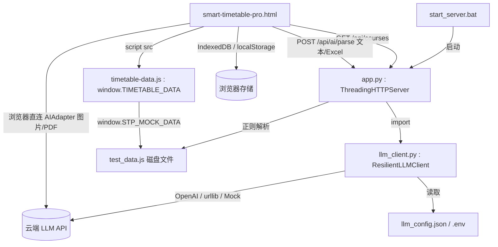
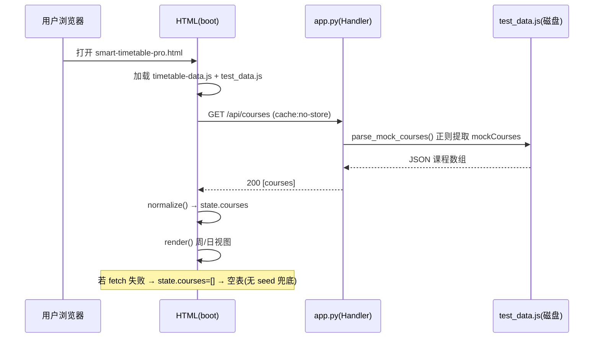
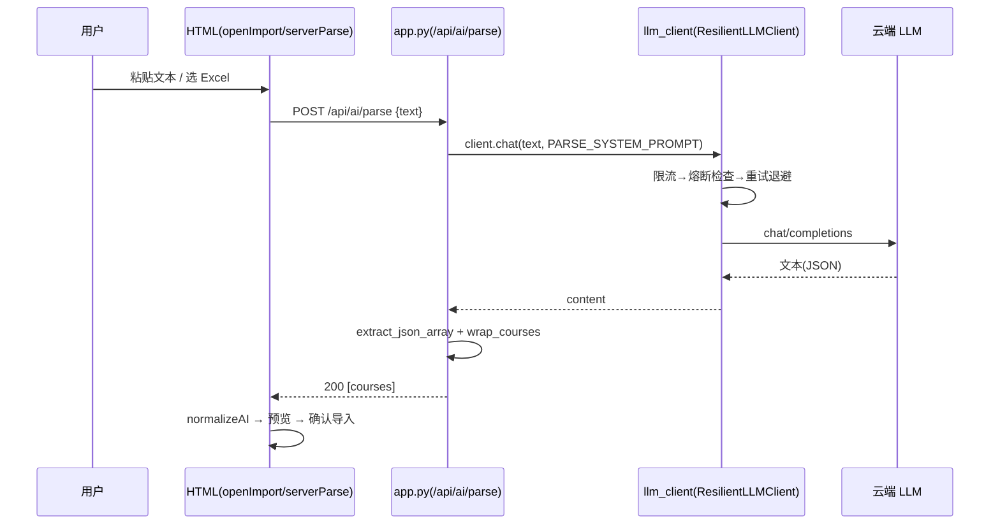
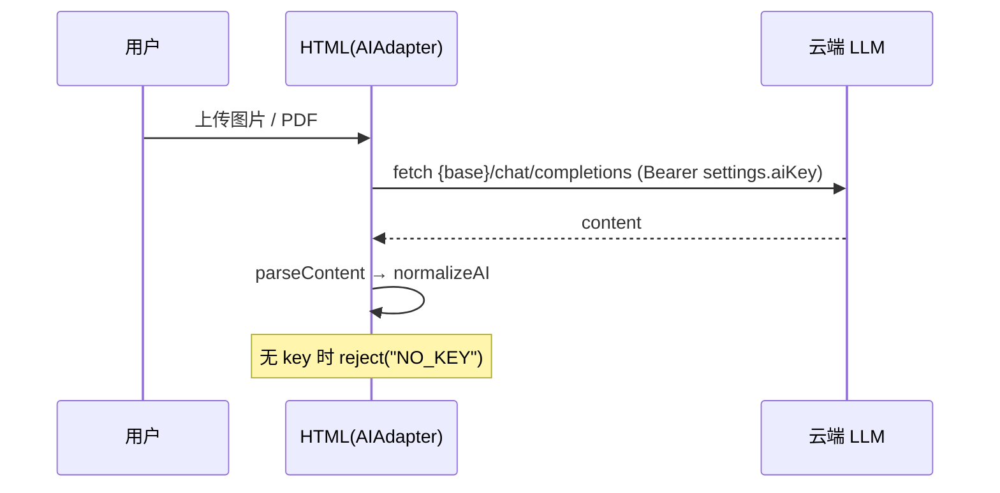

# 智能课表 Pro（smart-timetable-pro）代码分析报告

> 分析对象：`D:\实验室选拔\Work` 目录下的「智能课表」项目（smart-timetable-pro）
> 分析性质：**代码审计（非新功能开发）**
> 分析日期：基于仓库当前快照（文件修改时间集中在 2025-07-16 ~ 07-18）
> 覆盖维度：①项目结构 ②依赖关系 ③代码质量 ④架构与设计模式 ⑤入口与核心流程 ⑥潜在风险与改进建议

---

## 0. 分析范围与文件清单

以下文件均已实际读取并分析；目录中另有 `.workbuddy/`（工具链）、`__pycache__/`（Python 缓存，生成物，未分析）。

| 文件 | 大小 | 角色分类 | 分析结论 |
|------|------|----------|----------|
| `app.py` | 15.6 KB | 后端 / HTTP 服务 | Python 标准库单文件服务，提供 `/api/courses`、`/api/ai/parse`、静态资源与首页 |
| `llm_client.py` | 28.7 KB | 后端 / LLM 客户端 | 韧性 SDK：限流 + 熔断 + 重试 + 多传输层 + 日志脱敏，设计完整 |
| `llm_config.json` | 1.7 KB | 配置 | LLM 地址/模型/超时/韧性参数；`api_key` 为空、注释要求放 `.env` |
| `.env.example` | 0.8 KB | 配置模板 | 环境变量模板（`LLM_API_KEY` 等），`.env` 本身不存在 |
| `.gitignore` | 0.07 KB | 配置 | 忽略 `.env`、`__pycache__`，合理 |
| `start_server.bat` | 2.1 KB | 启动脚本 | 定位目录、探测 Python 解释器、启动 `app.py` |
| `manifest.webmanifest` | 0.56 KB | PWA 清单 | 引用 `icon.svg`（**该文件缺失**） |
| `smart-timetable-pro.html` | 121.5 KB | 前端 SPA（单文件） | 内联 CSS+JS，2414 行；课表渲染、增删改、AI 导入、规划、ICS 导出、设置 |
| `timetable-data.js` | 4.3 KB | 前端 / 静态配置 | `window.TIMETABLE_DATA`：布局、节次、配色、周次、规划模板、AI 提示词、`seedCourses` |
| `test_data.js` | 6.2 KB | 数据 / Mock | `window.STP_MOCK_DATA.mockCourses`：22 条示例课程（被后端正则解析、也被前端加载） |
| `icon.svg` | — | PWA 图标 | **目录中不存在**（manifest 与 HTML 均引用），见问题 I-01 |

---

## 1. 项目结构分析

### 1.1 目录组织

```
D:\实验室选拔\Work\
├── app.py                  # 后端：ThreadingHTTPServer 单文件服务
├── llm_client.py           # 后端：韧性 LLM 客户端（含限流/熔断/重试/传输/日志）
├── llm_config.json         # 配置：LLM 参数
├── .env.example            # 配置模板（真实 .env 不入库）
├── .gitignore
├── start_server.bat        # 启动脚本（Windows）
├── manifest.webmanifest    # PWA 清单
├── smart-timetable-pro.html# 前端：单文件 SPA（HTML+CSS+JS 全内联）
├── timetable-data.js       # 前端静态配置（window.TIMETABLE_DATA）
├── test_data.js            # Mock 课程数据（window.STP_MOCK_DATA）
└── (icon.svg 缺失)         # 被 manifest / HTML 引用但未提供
```

### 1.2 模块划分（按层次）

| 层次 | 文件 | 说明 |
|------|------|------|
| **后端服务** | `app.py` | 路由（`GET /`、`/api/courses`、`POST /api/ai/parse`、静态资源）、数据解析、提示词 |
| **后端能力** | `llm_client.py` | LLM 调用封装：配置加载、限流、熔断、重试、传输（OpenAI/urllib/Mock）、日志 |
| **配置** | `llm_config.json`、`.env.example`、`.gitignore` | 运行参数与密钥管理（密钥走 `.env`） |
| **前端（SPA）** | `smart-timetable-pro.html` | 唯一页面，内联全部样式与逻辑，无构建步骤 |
| **前端数据/配置** | `timetable-data.js`、`test_data.js` | 通过 `<script src>` 注入 `window` 全局对象 |
| **PWA** | `manifest.webmanifest`（+缺失 `icon.svg`） | 可安装性声明 |
| **启动** | `start_server.bat` | Windows 下启动后端 |

### 1.3 组织方式评价

- **优点**：零构建、零强依赖，理论上双击/起服务即可运行；前后端职责清晰（前端渲染、后端提供数据+AI 网关）；配置与代码分离。
- **不足**：前端为「巨石单文件」（2414 行、~121KB，CSS/JS/HTML 全内联），没有模块化拆分；存在**两套数据入口**（`test_data.js` 既被后端正则解析，又被前端 `window.STP_MOCK_DATA` 加载，但前端 `boot()` 实际只走 `fetch('/api/courses')`，见 §6 I-02、I-04）。

---

## 2. 依赖关系梳理

### 2.1 第三方依赖与版本

| 依赖 | 位置 | 版本/来源 | 类型 | 备注 |
|------|------|-----------|------|------|
| Python 标准库 | `app.py`/`llm_client.py` | 内置（http.server、urllib、json、threading、dataclasses…） | 运行时必需 | 零第三方强依赖 |
| `openai` (Python SDK) | `llm_client.py` | 未固定版本（`pip install openai`） | 可选 | 未安装时自动回退 `urllib`，无 `requirements.txt` |
| Google Fonts | HTML `<link>` | Noto Sans SC / Space Grotesk | 前端 CDN | 无 `integrity`（SRI）校验；离线降级到系统字体 |
| SheetJS (`xlsx`) | HTML `<script src>` | `xlsx@0.18.5`（jsDelivr CDN） | 前端 CDN | Excel 导入；无 SRI；加载失败时已有兜底提示 |
| 浏览器原生 API | HTML/JS | IndexedDB、localStorage、Fetch、FileReader、Blob、AbortController | 运行时 | 无需安装 |

### 2.2 模块依赖关系图



### 2.3 关键依赖链说明

- **启动链**：`start_server.bat` → 探测 Python → `app.py` 监听 `0.0.0.0:8000`。
- **数据链（课程）**：浏览器 `boot()` → `fetch('/api/courses')` → `app.py.do_GET` → `parse_mock_courses()`（正则提取 `test_data.js` 中 `mockCourses`）→ 返回 JSON → 前端 `normalize()` 渲染。
- **AI 链（文本/Excel）**：前端 `serverParse()` → `POST /api/ai/parse` → `app.py` → `get_llm_client().chat()` → `llm_client` 限流→熔断→重试→传输 → 云端 → `wrap_courses()` 规范化返回。
- **AI 链（图片/PDF）**：前端 `AIAdapter.parseImage/parseFile` → 浏览器**直接** `fetch` 云端 LLM（使用设置里的 `aiKey`）。
- **存储链**：`StorageAdapter` 优先 IndexedDB，失败降级 localStorage；课程与设置分别存于 `stp_db` / `localStorage` 键。

---

## 3. 代码质量评估

### 3.1 问题清单（质量维度）

| 编号 | 位置 | 问题描述 | 影响 | 等级 |
|------|------|----------|------|------|
| Q-01 | `smart-timetable-pro.html:729` `:923` `:2162` | 死代码：`seed()`、`layoutLanes()`、`templatePlan()` 定义后从未被调用 | 维护负担、误导读者 | P2 |
| Q-02 | `timetable-data.js:68` + `html boot()` | `DATA.seedCourses` 由 `window.STP_MOCK_DATA` 注入但 `boot()` 不再使用（仅用 `fetch`） | 数据入口冗余、file:// 下空表（见 I-02） | P1 |
| Q-03 | `html` 多处 | 规范化/提示词逻辑在前端（`normalize`/`normalizeAI`/`DATA.ai.prompts.parseText`）与后端（`wrap_courses`/`PARSE_SYSTEM_PROMPT`）各维护一份 | 易漂移、不一致 | P2 |
| Q-04 | `AIAdapter.parseFile` (`html:1587`) | `btoa(String.fromCharCode.apply(null, new Uint8Array(arrayBuffer)))`：大文件触发「Maximum call stack size exceeded」 | PDF 导入可能崩溃 | P2 |
| Q-05 | `overlaps()` (`html:753`) | 冲突检测仅按 `weekType` 粗判，未纳入显式 `weeks` 数组交集 | 不同周次可能误判/漏判冲突 | P2 |
| Q-06 | `html` 整体 | 单文件 2414 行，全部函数扁平挂在 IIFE 内（虽隔离全局，但无模块边界） | 可维护性、可测试性差 | P2 |
| Q-07 | `renderDay()` (`html:1116`) | 日视图空闲块 `ib.innerHTML=''` 为空（无「空闲」文字），与周视图不一致 | 轻微 UX 不一致 | P2 |
| Q-08 | `downloadICS()` (`html:2203`) | 生成 `.ics` 未做 75 字节行折叠（RFC5545 line folding），超长 DESCRIPTION 在严格解析器中可能出错 | 兼容性边缘问题 | P2 |
| Q-09 | `start_server.bat:28` | 硬编码 WorkBuddy Python 路径（有 PATH 回退） | 环境耦合（已有回退，影响小） | P2 |

### 3.2 正向质量点（值得肯定）

- **路径穿越防护良好**：`app.py.do_GET` 同时做扩展名白名单 + `".." 检查` + `abspath().startswith(BASE_DIR+sep)`，`.py` 源文件不会被静态服务暴露。
- **XSS 意识到位**：动态文本几乎都经 `esc()` / `escICS()` 转义后再写入 `innerHTML`；`el()` 工具统一创建元素。
- **韧性设计完善**：`llm_client.py` 的限流（令牌桶）、熔断（状态机）、重试（指数退避+抖动）、日志脱敏（`_mask`）均实现到位，且线程安全。
- **可访问性较好**：焦点陷阱 `trapFocus`、ARIA 角色/标签、键盘导航（`initRadioGroup` 方向键）覆盖较完整。
- **配置分层合理**：`.env > 环境变量 > llm_config.json > 内置默认`，密钥不硬编码进源码。
- **错误兜底**：全局 `window.error` 监听 + `errPage` 兜底页；后端统一 JSON 错误结构与 HTTP 状态映射。

---

## 4. 架构与设计模式

### 4.1 架构风格

- **本地优先 + 轻量数据服务（Local-First + Plan A）**：前端纯静态 SPA，数据由同目录 Python 标准库服务以 JSON 提供；无数据库，课程数据从 `test_data.js` 解析。
- **前后端协作**：前端负责渲染与交互，后端承担「数据接口 + AI 网关（代理云端 LLM）」；AI 解析采用「文本/Excel 走后端、图片/PDF 走浏览器直连」的双路径（见 §6 I-13）。
- **PWA（部分）**：提供 `manifest.webmanifest` 与移动端 meta，但**无 Service Worker**，故可安装但**不可离线**；且 `icon.svg` 缺失导致安装性本身受损。
- **SPA**：单一 HTML，视图（周/日）、抽屉（详情/表单/导入/规划/导出/设置）通过 DOM 局部渲染切换；无路由库（用 `state.view` + 重渲染）。

### 4.2 采用的设计模式

| 模式 | 体现 | 位置 |
|------|------|------|
| 单例（Singleton） | `get_llm_client()` 进程内共享一个客户端 | `llm_client.py:694` |
| 策略/组合（Strategy） | 限流、熔断、重试、传输层可替换组合 | `llm_client.py` `ResilientLLMClient` |
| 适配器（Adapter） | `StorageAdapter`（IndexedDB↔localStorage 自动降级）、`AIAdapter`（浏览器直连）、`Transport`（OpenAI/urllib/Mock） | HTML / `llm_client.py` |
| 状态对象（State） | 全局 `state`（view/weekOffset/filter/courses…）驱动渲染 | HTML `:661` |
| 模块对象（Module / IIFE） | 前端整段包在 IIFE 内避免污染全局 | HTML `:551` |
| 配置对象（dataclass） | `LLMConfig` 及子配置类 | `llm_client.py` |

### 4.3 合理性与可扩展性评估

- **合理性**：对「个人本地课表」这一目标，零依赖、零构建的方案降低了使用门槛；AI 网关后端代理便于统一密钥与限流，是合理的取舍。
- **可扩展性短板**：
  1. 数据层无持久化后端（仅浏览器存储 + Mock 文件），多端同步、多人协作无法支撑。
  2. 前端巨石文件导致功能扩展需在同一文件内改动，耦合高。
  3. `app.py` 路由为 `if/elif` 字符串匹配，新增接口需改 `Handler`，缺少路由抽象。
  4. PWA 缺 Service Worker，离线场景不可用。

---

## 5. 入口与核心流程

### 5.1 入口文件

- **后端入口**：`start_server.bat` → 定位目录、探测 Python（`C:\Users\lenovo\.workbuddy\...\python.exe` → `python` → `py`）→ `python app.py` → `ThreadingHTTPServer(("0.0.0.0",8000), Handler).serve_forever()`。
- **前端入口**：浏览器打开 `smart-timetable-pro.html` → `<head>` 预连接字体/加载 `xlsx` → `<body>` 渲染静态骨架 → `<script src="timetable-data.js">`（注入 `window.TIMETABLE_DATA`、并借 `test_data.js` 注入 `window.STP_MOCK_DATA`）→ 内联脚本 `boot()`。

### 5.2 核心流程时序图

**流程 A：启动加载课程**



**流程 B：文本 / Excel 的 AI 解析（走后端网关）**



**流程 C：图片 / PDF 的 AI 解析（浏览器直连）**



### 5.3 关键数据流

`test_data.js(源)` →（后端正则 / 前端 window 注入） → `normalize/wrap_courses` 统一为 8 字段课程（`name/teacher/location/weekday/startPeriod/endPeriod/weekType/colorIndex`，并扩展 `sections[]`/`weeks[]`） → `state.courses` → `renderWeek/renderDay` → DOM；导入/编辑经 `save()` 落 `StorageAdapter`。

---

## 6. 潜在风险与改进建议

### 6.1 问题清单（按严重程度 P0 / P1 / P2 分级）

> **P0 说明**：在**纯 localhost 运行**场景下，本次审计未发现会导致崩溃/数据丢失的 P0 级阻塞缺陷。但 **I-03（CORS `*` + 绑定 `0.0.0.0`）在「非 localhost / 局域网 / 公网」部署时会立即升级为 P0**（后端可代理付费 LLM，任意方都能消耗配额并读取课程）。

| 编号 | 等级 | 问题 | 位置 |
|------|------|------|------|
| I-01 | **P1** | `icon.svg` 缺失：manifest 与 HTML 均引用，文件不在目录 → PWA 不可安装、Lighthouse PWA 审计失败 | `manifest.webmanifest:14` / `html:13` |
| I-02 | **P1** | `boot()` 移除 file:// 兜底：仅依赖 `fetch('/api/courses')`，失败即空表；而 `timetable-data.js`/`test_data.js` 仍加载 `seedCourses` 却未使用，与设计注释「file:// 直接打开可用」矛盾 | `html:2386` vs `timetable-data.js:68` |
| I-03 | **P1** | 安全暴露面：`HOST="0.0.0.0"` + CORS `Access-Control-Allow-Origin: *`；后端可代理携带 key 的付费 LLM | `app.py:43,253` |
| I-04 | P2 | 死代码/冗余数据入口：`seed()`、`DATA.seedCourses`、`layoutLanes()`、`templatePlan()` 均未使用 | `html:729,923,2162` |
| I-05 | P2 | 重复逻辑：AI 提示词与课程规范化在前/后端各一份，易漂移 | `html` vs `app.py` |
| I-06 | P2 | 前后端 AI 默认配置不一致：前端 `api.openai.com/v1 + gpt-4o-mini`，后端 `siliconflow.cn + Qwen2.5-7B` | `timetable-data.js:90` vs `llm_config.json:6` |
| I-07 | P2 | 大文件 base64 风险：`btoa(String.fromCharCode.apply(...))` 可能栈溢出 | `html:1587` |
| I-08 | P2 | 冲突检测未考虑显式 `weeks` 数组，仅按 `weekType` 粗判 | `html:753` |
| I-09 | P2 | 前端巨石单文件（2414 行），无模块化/构建，可维护性差 | `smart-timetable-pro.html` |
| I-10 | P2 | 外部 CDN（字体、xlsx）无 SRI，存在供应链篡改风险；离线失效 | `html:16-19` |
| I-11 | P2 | 无 `requirements.txt`，`openai` 版本未固定；Python 路径硬编码（已有回退） | `start_server.bat:28` |
| I-12 | P2 | 非真正离线 PWA：有 manifest 无 Service Worker（叠加 I-01） | 全局 |
| I-13 | P2 | 前端直连 LLM 与后端代理并存，密钥管理/信任路径不统一 | `html:1556,1602` |

### 6.2 针对性改进建议（可落地）

| 对应问题 | 改进建议 |
|----------|----------|
| **I-01** | 补 `icon.svg`（任意 SVG，建议含 `maskable`）；或将 manifest `icons.src` 改为内联 `data:image/svg+xml` 避免路径依赖。 |
| **I-02** | 在 `boot()` 的 `fetch` 失败分支回退到 `DATA.seedCourses`（`if(!list.length && DATA.seedCourses?.length) state.courses=normalize(DATA.seedCourses)`），恢复 file:// 可用；或显式在文档/错误页注明「需先启动后端」。 |
| **I-03** | 默认 `HOST="127.0.0.1"`；`_add_cors` 限定 `Origin: http://localhost:8000`；若确需远程访问，增加简单 token 校验（如 `?token=` 或 Header），避免开放代理付费 LLM。 |
| **I-04** | 删除 `seed()`/`layoutLanes()`/`templatePlan()` 或将其接入实际路径（如 `seed()` 用于 I-02 兜底）；移除 `timetable-data.js` 中无用 `seedCourses` 或保留但加注释说明用途。 |
| **I-05** | 确立单一事实来源：提示词集中到 `timetable-data.js` 的 `ai.prompts`，后端 `load_config` 时读取同一文件（或前端直接复用后端返回结构）；规范化逻辑以「后端 `wrap_courses`」为准，前端 `normalizeAI` 与之对齐。 |
| **I-06** | 统一默认 base/model；或前端「以服务器配置优先」，设置页默认留空并由后端决定模型，避免用户困惑。 |
| **I-07** | 改用分块转换：`let bin=""; const bytes=new Uint8Array(ab); for(let i=0;i<bytes.length;i+=0x8000) bin+=String.fromCharCode.apply(null,bytes.subarray(i,i+0x8000)); btoa(bin);` 或直接 `FileReader.readAsDataURL(file)`。 |
| **I-08** | `overlaps()` 增加 `weeks` 交集判断：当双方都有 `weeks` 时，仅当周次交集非空才判冲突；`weekType` 与 `weeks` 二选一生效。 |
| **I-09** | 拆分前端为 ES Module（项目已在 `test_data.js` 预留 `import` 注释）；引入 Vite 构建，将 `css`/`js` 分文件，降低单文件复杂度、提升可测试性。 |
| **I-10** | 为 CDN 资源加 `integrity` + `crossorigin`；或将 `xlsx` 自托管到本地，离线也可用。 |
| **I-11** | 提供 `requirements.txt`（`openai==x.y.z`，可选）；或文档明确「无需安装即可用 urllib 回退」。 |
| **I-12** | 增加 Service Worker 缓存 `html/js/json`，实现离线 PWA；与 I-01 一并补齐图标。 |
| **I-13** | 统一走后端：扩展 `app.py` 支持图片/PDF base64 转发（`POST /api/ai/parse` 增加 `image`/`file` 类型），前端不再在前端持有 key；如坚持浏览器直连，设置页明示「Key 仅存本机、仅本地调用」。 |

### 6.3 优先级总结

- **立即处理（P1）**：I-01（补图标）、I-02（补 file:// 兜底或明确说明）、I-03（收紧绑定地址与 CORS，防开放代理）。
- **计划改进（P2）**：I-04~I-13，建议在下次迭代按「先去死代码/统一逻辑（I-04/I-05/I-06）→ 再加固安全与健壮性（I-07/I-08/I-10/I-11/I-13）→ 最后工程化（I-09/I-12）」的顺序推进。
- **当前亮点（保持）**：路径穿越防护、XSS 转义、限流/熔断/重试、可访问性、配置分层——这些实现质量较高，应作为后续重构的基线保留。

---

## 附：Mermaid 图索引

- §2.2 模块依赖关系图（graph TD）
- §5.2 流程 A 启动加载 / 流程 B 后端 AI 解析 / 流程 C 浏览器直连 AI 解析（sequenceDiagram）

> 注：本报告基于实际读取的文件内容生成；对未提供/缺失文件（如 `icon.svg`、`.env`）已如实标注，未做臆测。
