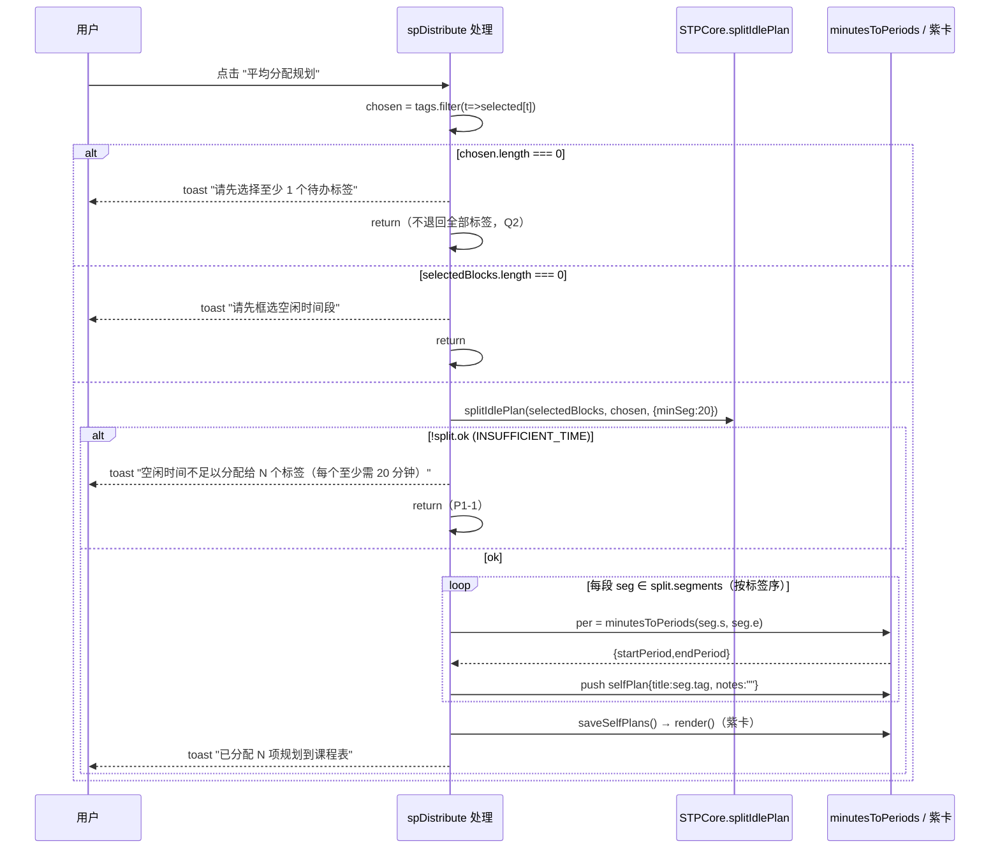
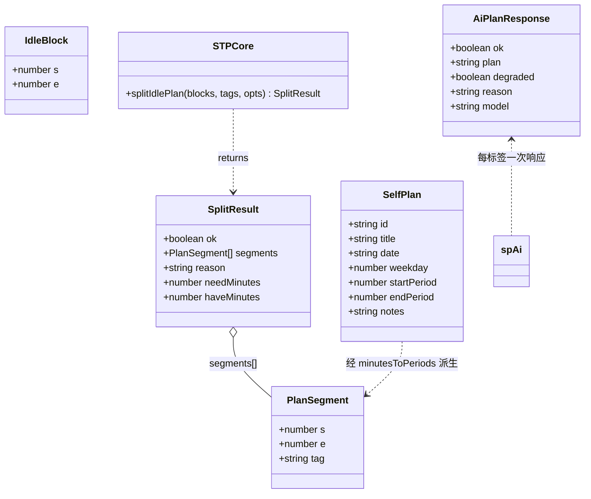
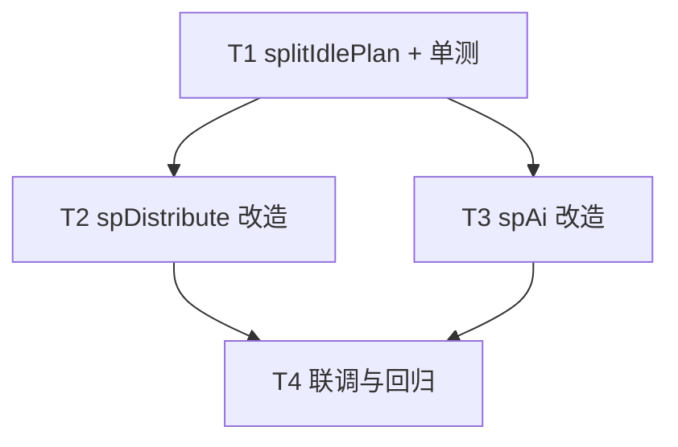

# 增量设计文档：空闲规划分配语义细化（N 标签 → N 时间段）

> 文档类型：**增量设计 + 任务分解**（仅描述本次变更，不重写全量设计）
> 上游输入：`analysis/INCREMENTAL_PRD_ALLOCATION_SEMANTICS.md`（产品经理增量 PRD）、`analysis/INCREMENTAL_DESIGN_AI_PLANNER.md`（上一版 AI 版设计，约定沿用）
> 产出角色：架构师（software-architect）
> 设计原则：**零三方依赖**；新增纯函数 `splitIdlePlan` 进 `timetable-core.js` 可 Node 单测；前端 `spDistribute`/`spAi` 调用它；后端 `/api/ai/plan` 契约**不改**。
> 落盘路径：`D:\实验室选拔\Work\analysis\INCREMENTAL_DESIGN_ALLOCATION_SEMANTICS.md`

---

## 1. 实现方案概述

### 1.1 核心思路

把"分段单元"从"框选空闲块数 m"改为"所选标签数 n"：N 个所选标签 → N 个时间段，每段一标签、空闲时间尽量均分、不跨越课程间隙。关键变化点：

| 项 | 现状（待改） | 本次目标 |
|---|---|---|
| 分段数 | `m = selectedBlocks.length`（按块数） | `n = chosen.length`（按标签数） |
| 段内容 | 一块可塞多标签（标题用"、"连接） | 每段**仅一个**标签，标题 = 标签名 |
| 未选标签 | `useTags = chosen.length ? chosen : tags`（退回全部） | 提示并 `return`，**不再退回全部**（Q2） |
| AI 调用 | 全部标签拼一条消息、调一次、同文本写所有块 | **每标签一条消息、串行 `await` 调一次、第 i 段写第 i 次返回**（Q3） |

### 1.2 新增/改动文件（零新增依赖）

- **新增纯函数** `splitIdlePlan(blocks, tags, opts)` 到 `timetable-core.js`（双环境导出，可 Node 单测）。它把"所选空闲并集"按总时长均匀切为 n 段，返回 `{ok, segments}` 或在时长不足时返回 `{ok:false, reason:"INSUFFICIENT_TIME", needMinutes, haveMinutes}`。前端 `spDistribute`/`spAi` 都先调它拿到 n 段（每段 `{s,e,tag}`），再用既有 `minutesToPeriods(s,e)` 映射节次并 push 紫卡 `selfPlan`。
- **前端** `smart-timetable-pro.html`：`spDistribute`、`spAi`、`buildAiMessages`、`callAiPlan`、`applyAiPlan`、`degradePlan` 改造（见 §3/§4）。
- **单测** `tests/test_core.mjs`：新增 `splitIdlePlan` 用例。
- **后端 `app.py`**：**不改**（契约已稳定，降级 reason 枚举沿用）。

### 1.3 为什么把算法放进 timetable-core.js（而非 HTML 内联）

- `timetable-core.js` 是既有"零依赖、零构建、双环境导出、可 Node 单测"的纯函数内核；分段算法是纯计算（只依赖分钟坐标，不碰 DOM），天然适合放入。
- 好处：可用 `node --test tests/test_core.mjs` 直接覆盖均分/拆分/时长不足等边界，无需开浏览器；工程师照 §9 伪代码即可落地，QA 照同伪代码写用例。

---

## 2. 文件清单与相对路径

> 相对路径以项目根 `D:\实验室选拔\Work\` 为基准。标注【改】= 修改，【新】= 新增，【删】= 删除/废弃。

| 文件 | 状态 | 本次改动要点 | 关联任务 |
|---|---|---|---|
| `timetable-core.js` | 【改】 | 新增纯函数 `splitIdlePlan(blocks, tags, opts)`；在 `STPCore` 对象与 `module.exports` / `window.STPCore` 导出中登记。 | T1 |
| `smart-timetable-pro.html` | 【改】 | ① `spDistribute` 改为 `chosen=…; n=chosen.length; STPCore.splitIdlePlan(selectedBlocks,chosen)`；未选标签提示并 `return`；不足时长提示并 `return`；每段 `minutesToPeriods`→紫卡；② `spAi` 改为每标签串行 `await callAiPlan(buildAiMessagesForTag(tag))`，第 i 段 notes=第 i 次返回，单标签降级不中断，结束汇总；③ `buildAiMessages` → 拆为 `buildAiMessagesForTag(tag)`（单标签）；④ `callAiPlan` 改返回 `Promise`（便于 `await`）；⑤ `applyAiPlan`【删】/ `degradePlan`【废弃】，其职责由分段循环内的"逐段 push + 单标签本地兜底"取代。 | T2 / T3 |
| `tests/test_core.mjs` | 【改】 | 新增 `splitIdlePlan` 单测：均分、块内拆分（n>块）、时长不足、空标签、minSeg 选项、极端夹紧兜底。 | T1 |
| `app.py` | （不改） | 后端 `/api/ai/plan` 契约不变；前端串行 `await` 已规避 `_ai_min_interval` 限流。 | — |

> 说明：本次为**纯增量**，无新配置项、无新依赖、无需改 `.env`/`.env.example`/README。任务数 = 4（≤5），首任务即"核心纯函数 + 单测"（因为本次没有新的配置文件/入口/依赖可放进"基础设施"任务，零新增依赖红线决定了 T1 自然就是纯函数 + 测试这一基础件）。

---

## 3. 数据结构与接口

### 3.1 新增纯函数 `splitIdlePlan`（位于 `timetable-core.js`）

**入参**

| 参数 | 类型 | 说明 |
|---|---|---|
| `blocks` | `Array<{s:number, e:number}>` | 用户框选的空闲段（分钟坐标，来自 `freeForDate()`，已 ≥20min，按 `s` 升序）。若某块 `s/e` 为 `"HH:MM"` 字符串，用 `opts.toMin` 归一。 |
| `tags` | `Array<string>` | **所选标签数组 `chosen`**，顺序即段顺序（第 i 标签 → 第 i 段）。 |
| `opts` | `{minSeg?:number, toMin?:(hm:string)=>number}` | `minSeg` 默认 `20`（与 `idleBlocks` 的 20min 阈值一致）；`toMin` 缺省实现同 `idleBlocks`。 |

**返回**

```js
// 成功
{ ok: true, segments: Array<{ s:number, e:number, tag:string }> }   // 段按时间升序，tag 与 tags 同序
// 失败（标签为空，防御性，前端已先拦截）
{ ok: false, reason: "NO_TAGS" }
// 失败（所选空闲并集总时长不足）
{ ok: false, reason: "INSUFFICIENT_TIME", needMinutes: number, haveMinutes: number }  // needMinutes = n*minSeg
```

**不变量（实现必须保证）**
- 每段 `[s,e]` 完全落在某一个空闲块内（**绝不跨课程间隙**）；`e - s ≥ minSeg`（夹紧兜底也 ≥ 块尺寸 ≥ minSeg）。
- `segments.length === n === tags.length`；`segments[i].tag === tags[i]`。
- 段之间首尾相接、无重叠、覆盖所选空闲并集（在块内顺序浇筑语义下成立）。

### 3.2 段 → 紫卡 `selfPlan` 的映射（前端既有关怀复用）

`splitIdlePlan` 返回后，前端对每段：

```js
var per = minutesToPeriods(seg.s, seg.e);   // 既有闭包：分钟区间 → {startPeriod,endPeriod}
state.selfPlans.push({
  id: uid(),
  title: seg.tag,                            // 段标题 = 标签名（平均分配 / AI 一致）
  date: fmtDateInput(selectedDate),
  weekday: currentWeekday,
  startPeriod: per.startPeriod,
  endPeriod: per.endPeriod,
  notes: /* 平均分配: ""（标题已含标签）；AI: 第 i 次返回文本 / 单标签降级时的本地兜底文本 */
});
```

紫卡渲染（`render()` 内 `selfPlan` 分支，约 `:1126-1131`、`:1366-1382`）、编辑/删除（`openSelfPlanDetail`）、`saveSelfPlans()` 全部**复用既有逻辑，无回归**。

### 3.3 AI 调用相关接口（前端改造，契约沿用上版）

| 函数 | 新签名（前端内） | 说明 |
|---|---|---|
| `buildAiMessagesForTag` | `(tag:string) -> Array<{role,content}>` | 由旧 `buildAiMessages()` 改造：仅把**单个** `tag` 拼进 user 消息；`plan_type` 由 `detectTemplate(tag)` 推导（`study`/`kaoyan`/`kg`，缺省 `study`）。 |
| `callAiPlan` | `(messages, planType) -> Promise<{ok,plan,degraded,reason,model}>` | 由旧回调式改为 **Promise**（内部 `fetch` + `.then`/`.catch`，网络异常 `.catch` 中 `resolve({ok:false,degraded:true,reason:"AI_NETWORK",plan:null})`，**不 reject**，以便 `await`）。 |
| `applyAiPlan` | 【删】 | 旧"同一文本写所有块"逻辑删除；由分段循环内的逐段 push 取代。 |
| `degradePlan` | 【废弃】 | 旧"模拟点击 spDistribute"不再被 `spAi` 调用；单标签降级改为循环内本地兜底（见 §4 图 B）。保留空函数或删除均可。 |

> 后端响应契约（沿用上版，本次不改）：`{ok, plan, degraded, reason, model}`，HTTP 200 承载降级；`reason` 枚举：`AI_DISABLED` / `AI_RATE_LIMITED` / `AI_TIMEOUT` / `AI_NETWORK` / `AI_HTTP_4XX` / `AI_HTTP_5XX` / `AI_UPSTREAM_429` / `AI_JSON` / `AI_EMPTY`。

---

## 4. 程序调用流程（Mermaid 时序图）

> 两张图分别描述"平均分配"与"AI 每标签一段"链路。完整 mermaid 源另存于 `docs/sequence-diagram.mermaid`。

### 图 A · 平均分配（spDistribute）



### 图 B · AI 每标签一段（spAi，串行 + 进度 + 单标签降级）

```mermaid
sequenceDiagram
    participant U as 用户
    participant A as spAi 处理
    participant C as STPCore.splitIdlePlan
    participant B as buildAiMessagesForTag
    participant F as callAiPlan (fetch /api/ai/plan)

    U->>A: 点击 "⚡ AI 生成复习建议"
    A->>A: chosen = tags.filter(t=>selected[t])
    alt chosen.length === 0
        A-->>U: toast "请先选择至少 1 个待办标签"
        A->>A: return（Q2）
    else selectedBlocks.length === 0
        A-->>U: toast "请先框选空闲时间段"
        A->>A: return
    else
        A->>A: btn.disabled=true; spAiStatus="⏳ AI 生成中…"
        A->>C: splitIdlePlan(selectedBlocks, chosen, {minSeg:20})
        alt !split.ok (INSUFFICIENT_TIME)
            A-->>U: toast "空闲时间不足以分配给 N 个标签（每个至少需 20 分钟）"
            A->>A: 恢复按钮; return（P1-1）
        else ok
            A->>A: segments = split.segments; degraded=[]
            loop i = 0 .. N-1（串行 await，不并发）
                A->>A: spAiStatus = "⏳ 正在为第 (i+1)/N 个标签生成复习建议…"
                A->>B: buildAiMessagesForTag(chosen[i])
                B-->>A: messages
                A->>F: await callAiPlan(messages, detectTemplate(chosen[i]))
                F-->>A: {ok, plan, degraded, reason}
                alt ok && plan
                    A->>A: segments[i].notes = plan
                else 降级（限流/超时/断网…）
                    A->>A: segments[i].notes = localFallback(chosen[i])  // 本地兜底文本，标记
                    A->>A: degraded.push(i)  // 不中断其余标签（P1-3/Q3）
                end
            end
            loop 每段 seg ∈ segments
                A->>A: per = minutesToPeriods(seg.s, seg.e); push selfPlan{title:seg.tag, notes:seg.notes}
            end
            A->>A: saveSelfPlans() → render()（紫卡）
            alt degraded.length === 0
                A-->>U: toast "✅ 已为 N 个标签生成复习建议"
                A->>A: spAiStatus="✅ 已为 N 个标签生成复习建议"
            else
                A-->>U: toast "⚠️ 第 X、Y 个标签 AI 暂不可用，已用本地建议"
                A->>A: spAiStatus="⚠️ 第 X、Y 个标签 AI 暂不可用，已用本地建议"
            end
            A->>A: btn.disabled=false; closeSheet()
        end
    end
```

> `localFallback(tag)` 默认实现：`"（AI 暂不可用，已用本地建议：" + tag + "）"`；工程师可改为调用既有 `templatePlan(detectTemplate(tag), [seg])` 取更丰富文案（可选，不影响契约）。

---

## 5. 类 / 数据结构图（Mermaid classDiagram）

> 完整 mermaid 源另存于 `docs/class-diagram.mermaid`。



---

## 6. 任务列表（有序、含依赖、按实现顺序）

> 约束：任务数 ≤5；每任务涉及文件 ≥1（本次按 team-lead 指示不强凑 3 个）；除 T1 外仅依赖 T1；归属标注前端/测试。后端不改，故无后端任务。

### T1 · 纯函数 `splitIdlePlan` 实现 + 单测　【无依赖，最先做】
- **归属**：前端 / 测试
- **文件**：
  1. `timetable-core.js`【改】— 实现 §3.1 `splitIdlePlan`（双环境导出登记）。
  2. `tests/test_core.mjs`【改】— 新增 `splitIdlePlan` 单测（见 §9 用例）。
- **依赖**：无
- **交付判据**：`node --test tests/test_core.mjs` 全绿；覆盖"均分 / 块内拆分(n>块) / INSUFFICIENT_TIME / 空标签(NO_TAGS) / minSeg 选项 / 极端夹紧兜底"；段不跨间隙、tag 序一致、`e-s≥minSeg`。

### T2 · 前端 `spDistribute` 改造（平均分配：N 标签 → N 段）　【依赖 T1】
- **归属**：前端
- **文件**：
  1. `smart-timetable-pro.html`【改】— `openPlanner` 内 `spDistribute` 监听：删 `useTags=tags` 兜底；`chosen` 为空→提示 return（Q2）；调 `STPCore.splitIdlePlan`；`!ok`→按 N 提示 return（P1-1）；每段 `minutesToPeriods`→紫卡 `selfPlan`（标题=标签，notes 空）。
- **依赖**：T1
- **交付判据**：未选标签→提示无规划；N 所选标签→N 张紫卡、每段一标签、时长均分且 ≥20min 不跨课程；总时长不足→提示含 N；既有紫卡编辑/删除/持久化无回归。

### T3 · 前端 `spAi` 改造（每标签一段、串行、降级容错）　【依赖 T1】
- **归属**：前端
- **文件**：
  1. `smart-timetable-pro.html`【改】— `spAi` 监听：`buildAiMessages`→`buildAiMessagesForTag(tag)`；`callAiPlan` 改 Promise；串行 `await` 循环（不并发，规避 `_ai_min_interval`）；进度文案随 i 更新（P1-3）；第 i 段 notes=第 i 次返回；单标签降级→本地兜底+标记，不中断；结束汇总成功/部分降级；删 `applyAiPlan`、废弃 `degradePlan`。
- **依赖**：T1
- **交付判据**：调用次数=N 且串行；不同段 notes 互不相同（除非模型恰同）；进度文案实时更新；单标签降级其余继续、结束给整体状态；紫卡落盘无回归；`degraded` 仅入日志不展示内部 reason。

### T4 · 联调与回归（手测 + 既有功能无回归）　【依赖 T2、T3】
- **归属**：前端 / QA
- **文件**：
  1. `smart-timetable-pro.html`【改/验证】— 浏览器手测清单（见下）。
  2. `tests/test_core.mjs`【验证】— 回归 `node --test` 全绿。
- **依赖**：T2、T3
- **交付判据**：手测清单全过；`node --test tests/test_core.mjs` 仍全绿；后端契约未动；既有空闲规划/紫卡/ICS/软删等行为无回归。

**手测清单（T4）**
1. 添加 3 个标签、选中全部、框选 2 段空闲 → 点"平均分配"：得 3 张紫卡、每段一标签、时长均分、不跨课程。
2. 不选中任何标签 → 点任一规划按钮：提示"请先选择至少 1 个待办标签"，无规划产生。
3. 选 1 个标签、框选 1 段（如 30min）→ 点"平均分配"：提示"空闲时间不足以分配给 1 个标签（每个至少需 20 分钟）"。
4. 选 3 标签、框选 1 段（≥60min）→ 点"平均分配"：该段被拆为 3 子段，每段一标签。
5. 配 KEY 且 AI 正常 → 点"AI 生成"：N 次串行调用、每段不同 notes、结束"✅ 已为 N 个标签生成复习建议"。
6. 断网 / 无 KEY → 点"AI 生成"：每段本地兜底、结束"⚠️ 第 X、Y 个标签 AI 暂不可用，已用本地建议"，紫卡仍落盘。
7. 紫卡点击可编辑/删除，`saveSelfPlans` 持久化正确。

### 任务依赖图



---

## 7. 依赖包列表

- **新增第三方依赖**：**无**。
- **用到的标准库 / 内置能力**：
  - 前端（运行）：浏览器原生 JS（含 `async/await`、`fetch`、`Promise`），无库、无构建。
  - 前端（测试）：`node:test`、`node:assert`、`module`（`createRequire`），Node ≥18 内置，零 npm 依赖。
  - 内核：`timetable-core.js` 零依赖、零构建（沿用上版双环境导出）。
- **后端**：`app.py` 本次**不改**，继续用既有 `urllib.request` + `threading.Lock` 令牌桶。

---

## 8. 共享知识（跨文件约定）

- **分钟坐标映射规则**：`splitIdlePlan` 只在"分钟坐标空间"内计算段；段 `[s,e]` 由"块内顺序浇筑"得到，保证每段完全落在某个空闲块内，**绝不落入课程间隙**（映射只遍历空闲区间）。前端用既有 `minutesToPeriods(s,e)` 把分钟段映射回节次，无需在 core 内处理节次。
- **20min 阈值一致性**：`splitIdlePlan` 默认 `minSeg=20`，与 `idleBlocks` 过滤 `<20min` 块的阈值一致；故进入规划的块均 ≥20，`INSUFFICIENT_TIME` 判据 `total < n*20` 即"无法给每段挤满 20min"。
- **AI 串行规避限流**：`spAi` 必须**串行 `await`** 调 `callAiPlan`（每标签一次），不可 `Promise.all` 并发，否则触发后端 `_ai_min_interval` 限流的 `AI_RATE_LIMITED` 降级。
- **标签↔段顺序约定**：段与 `chosen` 数组**严格按序一一对应**——`splitIdlePlan` 返回 `segments[i].tag === chosen[i]`；`spAi` 第 i 次 AI 返回写入 `segments[i].notes`。顺序即 UI 中标签出现/选中顺序。
- **零依赖红线**：`timetable-core.js` 不引用 `document/window/$/DATA/state`；`splitIdlePlan` 仅依赖入参 `blocks/tags/opts`，不读全局；保持可在 Node 单测。
- **降级 reason 不外露**：前端单标签降级时只提示"AI 暂不可用，已用本地建议"，内部 `reason` 仅入日志（沿用上版 §8 约定）。
- **紫卡结构约定**：`selfPlan` 字段 `{id,title,date,weekday,startPeriod,endPeriod,notes}` 全量复用，本次仅把"标题=标签、notes=该段内容"写入，渲染/编辑/删除/持久化一律复用既有逻辑。

---

## 9. 分段算法伪代码（`splitIdlePlan` 核心步骤，供工程师落地 / QA 写用例）

```
函数 splitIdlePlan(blocks, tags, opts):
  输入:
    blocks : [{s,e}]            # 分钟坐标，用户框选空闲段（来自 freeForDate），已≥20
    tags   : [string]           # 所选标签 chosen，顺序即段顺序
    opts   : { minSeg=20, toMin? }
  输出:
    成功 { ok:true, segments:[{s,e,tag}] }
    失败 { ok:false, reason:"NO_TAGS" }
    失败 { ok:false, reason:"INSUFFICIENT_TIME", needMinutes, haveMinutes }

  步骤:
  1. n = tags.length
     若 n === 0: 返回 { ok:false, reason:"NO_TAGS" }

  2. 归一 blocks:
     - 若某块 s/e 为字符串，用 opts.toMin 转分钟（默认 toMin(hm): 时*60+分）
     - 过滤 e > s，按 s 升序排序（防御）
     - 若归一后无块: 返回 { ok:false, reason:"INSUFFICIENT_TIME", needMinutes:n*minSeg, haveMinutes:0 }

  3. total = Σ(e - s)
     若 total < n * minSeg:
        返回 { ok:false, reason:"INSUFFICIENT_TIME", needMinutes:n*minSeg, haveMinutes:total }

  4. # 理想段长：整数分钟，余数补给前 rem 段，Σ lens = total
     base = floor(total / n)
     rem  = total % n
     lens[i] = base + (i < rem ? 1 : 0)          # i = 0..n-1

  5. # 块内顺序浇筑（block-respecting greedy pour）：每段落在单空闲块内、绝不跨课程间隙
     segments = []
     bi = 0                                      # 当前块索引
     cur = blocks[0].s                           # 真实分钟游标
     blkEnd = blocks[0].e
     for i in 0 .. n-1:
        want = lens[i]                           # ≥ minSeg
        # 当前块剩余不足且还有下一块 → 跳到下一块（不把一段拆到间隙两侧）
        while (blkEnd - cur) < want and bi < blocks.length - 1:
            bi += 1; cur = blocks[bi].s; blkEnd = blocks[bi].e
        # 极端兜底（仅当存在 < ideal 的块时发生，正常数据不触发）：夹紧到块尾，保证不跨间隙
        if (blkEnd - cur) < want:
            want = blkEnd - cur                  # 安全兜底，段长可能 < ideal（仍 ≥ 块尺寸 ≥ minSeg）
        segS = cur; segE = cur + want
        segments.push({ s:segS, e:segE, tag:tags[i] })
        cur = segE
        if cur >= blkEnd and bi < blocks.length - 1:
            bi += 1; cur = blocks[bi].s; blkEnd = blocks[bi].e
     返回 { ok:true, segments:segments }

# 性质（实现须满足，供单测断言）:
#  (a) segments.length === n；segments[i].tag === tags[i]
#  (b) 每段 [s,e] 完全落在某个空闲块内（不跨课程间隙）
#  (c) e - s ≥ minSeg（夹紧兜底也 ≥ 块尺寸 ≥ minSeg）
#  (d) total ≥ n*minSeg 时必然 ok:true；否则 INSUFFICIENT_TIME
```

**单测用例建议（`tests/test_core.mjs`）**
| 用例 | 输入 blocks / tags / opts | 期望 |
|---|---|---|
| 均分（n=块） | `[{0,120},{120,240}]` / `["A","B"]` / 默认 | `ok:true`，两段 `[0,120]`/`[120,240]`，tag 序一致 |
| 块内拆分（n>块） | `[{0,60}]` / `["A","B","C"]` | `ok:true`，三段 `[0,20]`/`[20,40]`/`[40,60]`，每段 ≥20 |
| 时长不足 | `[{0,30}]` / `["A","B"]` | `ok:false, reason:"INSUFFICIENT_TIME", needMinutes:40, haveMinutes:30` |
| 空标签 | `[]` / `[]` | `ok:false, reason:"NO_TAGS"` |
| minSeg 选项 | `[{0,50}]` / `["A","B"]` / `{minSeg:30}` | `ok:false`（50<60）或 `minSeg:20` 时 `ok:true` 两段 |
| 极端夹紧兜底 | `[{0,20},{20,220}]` / `["A","B"]`（total=220,n=2,lens=[110,110]） | `ok:true`，段 `[20,130]`/`[130,220]`（块内不跨间隙，段长 110/90，锁定此行为） |
| 乱序块归一 | `[{120,240},{0,120}]` / `["A","B"]` | 归一排序后同"均分"用例 |

---

## 10. 待明确事项与默认决策（Q1/Q2/Q3 拍板）

| 问题 | 拍板结论（默认实现） |
|---|---|
| **Q1 分段算法** | 采用 §9 的"`splitIdlePlan`：块内顺序浇筑 + 整数整除均分 + 余数补给前 rem 段 + 极端夹紧兜底"。在所选空闲并集的分钟坐标上按 `segLen=floor(total/n)`、余数补给前 `rem` 段切分，再把分钟段映射回真实时间（仅遍历空闲区间，绝不落课程间隙）。n>块：把较长块拆为多个子段（每段一标签）；n<块：按总时长重新均匀切、段顺序遍历所有块（而非简单取前 n 块）；极端小块的夹紧兜底保证"不跨间隙"优先于"绝对均分"。算法实现为 `timetable-core.js` 的纯函数 `splitIdlePlan`。 |
| **Q2 未选标签** | 两个规划按钮点击时若 `chosen.length===0`，`toast("请先选择至少 1 个待办标签")` 并 `return`，**不再退回全部标签**；同时保留"未框选空闲段"提示（无段无法分段）。 |
| **Q3 AI 降级与映射** | 标签↔段严格按 `chosen` 数组序一一对应（第 i 标签 → 第 i 段 → 第 i 次 AI 返回）；每标签**串行 `await`** `callAiPlan(buildAiMessagesForTag(tag))`（规避限流）；单标签降级时该段回退本地建议并标记、不中断其余标签；循环结束按 `degraded` 集合给出整体状态（成功 / 部分降级）。 |
| 其余 | 沿用上版 AI 设计：后端契约不改、降级 reason 枚举不变、前端不重试、`degradePlan` 废弃、紫卡结构/渲染/编辑/删除/持久化全复用。 |

> 落盘路径：`D:\实验室选拔\Work\analysis\INCREMENTAL_DESIGN_ALLOCATION_SEMANTICS.md`
> 提取图：`docs/sequence-diagram.mermaid`（图 A/B）、`docs/class-diagram.mermaid`（§5）
> 设计范围：仅本次增量（空闲规划分配语义细化：N 标签 → N 时间段），不含全量重写、AI 一键导入、多日规划等。
