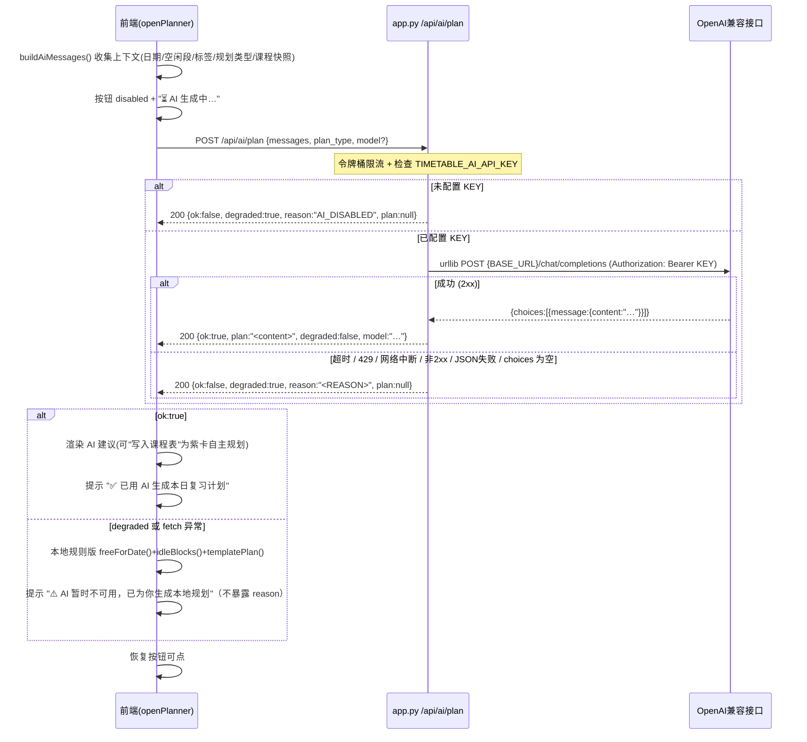
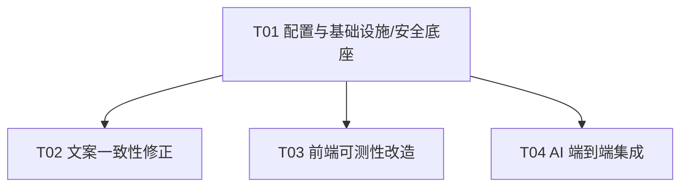

# 增量设计文档：空闲规划接入 AI（AI 课余规划助手升级）

> 文档类型：**增量设计 + 任务分解**（仅描述本次变更，不重写全量设计）
> 上游输入：`analysis/INCREMENTAL_PRD_AI_PLANNER.md`、`原文档需求.md`、`analysis/REQUIREMENT_COMPLIANCE_REVIEW.md`
> 产出角色：架构师（software-architect）
> 设计原则：**零三方依赖**；AI 调用只用标准库 `urllib.request`；可测性改造不破坏前端既有行为。

---

## 0. 阅读源码后的关键事实澄清（先正视听）

| 事项 | 审查/PRD 表述 | 实际源码核查结论 | 影响 |
|---|---|---|---|
| **R10 docstring 不符项位置** | "auth.py `_get_current_user_id` docstring"（PRD Q7 / 审查 R10 / P2-8） | `_get_current_user_id` **实际位于 `app.py:356`**，`auth.py` 中**不存在**该函数 | P1-2 的"auth.py 文案修正"应**重定向为 `app.py:356`** 的 docstring 修正；`auth.py` 无需改动 |
| **auth.py 是否含 bcrypt/Fernet/api_key 误导文案** | 用户点名"auth.py 含 bcrypt/api_key(Fernet) 描述" | 通读 `auth.py`（1–281 行）：**零** bcrypt / Fernet / api_key / "API Key" 字符串；密码哈希实际委托 `crypto.py.hash_password`（PBKDF2-HMAC-SHA256，crypto.py:112–127，用户级 salt） | `auth.py` 不需要任何文案修改 |
| **crypto.py 的 Fernet** | — | `crypto.py:51–56,99` 的 Fernet 是**可选依赖**，仅用于"未设 `TIMETABLE_SECRET_KEY` 时生成临时开发密钥"的兜底，**表述准确**，非不实声称 | 不改 `crypto.py` |
| **真正的 bcrypt/Fernet/api_key 不实表述** | 审查 P2-3 | `schema.sql:9 / 11 / 35`、` .env.example:16`、`smart-timetable-pro.html:2369` | 这三处才是 P1-1 / P2-3 的修正目标 |
| **`logging_config.json` 移动是否足够** | PRD P1-4："移至 `config/logging_config.json` 即可防下载" | `app.py:647` 的 `STATIC_EXTS` 含 `.json`，且静态处理器对 `BASE_DIR` 下**任意子目录**的白名单扩展名文件都会服务（`GET /config/logging_config.json` 仍在白名单内）→ **仅移动目录不能防下载** | 必须**同时把 `.json` 从 `STATIC_EXTS` 移除**，移动目录才真正生效（设计见 T01） |

> **重要提示（给 PM / 主理人）**：PRD 中 Q7 把 R10 归因于 `auth.py` 是误定位；本设计已据实更正，P1-2 实际改动点在 `app.py:356`。

---

## 1. 实现方案概述

### 1.1 架构总览

```
┌──────────────────────┐        POST /api/ai/plan         ┌──────────────────────────┐
│  前端 (单文件 vanilla) │ ───────────────────────────────▶ │  app.py (本地后端, 零依赖) │
│  smart-timetable-pro  │   {messages, plan_type, model?}  │  _handle_ai_plan()        │
│  -html                │                                    │   ├─ 限流锁 + 令牌桶       │
│  - buildAiMessages()  │ ◀─────────────────────────────── │   ├─ 校验 TIMETABLE_AI_*   │
│  - callAiPlan()       │   {ok, plan, degraded, reason}    │   └─ urllib.request ──────┼──▶ OpenAI 兼容接口
│  - 渲染 / 降级        │                                    │      (Bearer KEY)         │    {BASE_URL}/chat/completions
└──────────────────────┘                                    └──────────────────────────┘
        │                                                              │
        │  降级分支: degraded:true → 前端回退 freeForDate+idleBlocks+   │
        │  templatePlan（既有规则版），提示"AI 暂不可用，已用本地规划"   │
        ▼                                                              ▼
  timetable-core.js (纯函数, 双环境导出, 可 Node 单测)
```

### 1.2 核心流程时序图（前端 → /api/ai/plan → urllib → AI → 回传；含降级分支）



---

## 2. 框架 / 技术选型（确认零三方依赖）

| 层 | 选型 | 依赖 | 说明 |
|---|---|---|---|
| 后端 AI 调用 | Python 标准库 `urllib.request` / `urllib.error` | **零三方** | 严格禁止 `requests` / `openai` 等第三方包 |
| 后端限流 | `threading.Lock` + 时间戳令牌桶 | 标准库 | 单进程内即可 |
| 前端可测性 | `timetable-core.js` 抽取纯函数 + 双环境导出 | **零三方 / 零构建** | 不引入 webpack/vite/jsdom/npm |
| 前端单测 | `node --test`（Node ≥18 内置）+ `node:assert` | **零 npm 依赖** | 不新增 `package.json`（保持 vanilla 项目零配置） |
| 配置 | `.env`（沿用现有 `_load_dotenv()` 零依赖加载器） | 标准库 | AI / CORS 配置项新增于此 |

**结论**：本次变更**无任何新增第三方依赖**；前端仍为"单文件 HTML + 零构建"，后端仍"装 Python 即可 `python app.py`"。

---

## 3. 文件清单与相对路径

> 相对路径以项目根 `D:\实验室选拔\Work\` 为基准。标注【改】= 修改，【新】= 新增，【移】= 移动。

| 文件 | 状态 | 本次改动要点 | 关联任务 |
|---|---|---|---|
| `app.py` | 【改】 | ① CORS 收紧（`_add_cors` 按 `TIMETABLE_CORS_ORIGIN` 回显/不回显）+ 静态文件去 CORS；② `STATIC_EXTS` 移除 `.json`；③ `_get_current_user_id` docstring 修正（L356-361）；④ 新增 `POST /api/ai/plan` 代理（`_handle_ai_plan` + urllib + 限流 + 降级）+ `do_POST` 路由分支 | T01 / T02 / T04 |
| `smart-timetable-pro.html` | 【改】 | ① L2369 `auNote` 文案修正（去 API Key 加密不实表述）；② 引入 `<script src="timetable-core.js">`；③ `idleBlocks`/`openForm` 校验段/`softDelete`/`downloadICS` 改调 `STPCore`；④ 新增"⚡ AI 生成复习建议"按钮 + `buildAiMessages`/`callAiPlan` + 渲染/降级 + loading/提示 | T02 / T03 / T04 |
| `timetable-core.js` | 【新】 | 纯函数模块（见 §4.2），`module.exports` + `window.STPCore` 双环境导出 | T03 |
| `tests/test_core.mjs` | 【新】 | Node 内置 `node --test` + `node:assert`，零依赖测试 `timetable-core.js` | T03 |
| `logger.py` | 【改】 | `CONFIG_FILE_NAME` 加载路径由项目根改为 `config/logging_config.json`（L431） | T01 |
| `logging_config.json` | 【移】 | 由项目根移动到 `config/logging_config.json`（内容不变） | T01 |
| `.env.example` | 【改】 | 新增 `TIMETABLE_AI_API_KEY` / `TIMETABLE_AI_BASE_URL` / `TIMETABLE_AI_TIMEOUT` / `TIMETABLE_AI_RATE_LIMIT` / `TIMETABLE_AI_MODEL` / `TIMETABLE_CORS_ORIGIN`；修正 L16 "用于加密 API_KEY" 注释为真实描述 | T01 |
| `schema.sql` | 【改】 | L9 / L11 / L35 修正 bcrypt / api_key(Fernet) 注释 → PBKDF2 真实描述并注明"无 api_key 列" | T02 |
| `README.md` | 【新】 | AI 配置（.env 六项）、CORS 来源、本地运行、降级说明（回应审查 P2-6） | T04 |

---

## 4. 数据结构与接口

### 4.1 `POST /api/ai/plan` 接口约定

**请求体（前端组装并上送，后端不读数据库）**

```jsonc
{
  "messages": [                       // 必填：前端已组装的 OpenAI chat 消息数组
    {"role":"system","content":"你是课程规划助手…"},
    {"role":"user","content":"日期/星期/单双周/空闲段/标签/规划类型/课程快照…"}
  ],
  "plan_type": "study|kaoyan|kg",     // 可选：用于日志/统计；内容已在 messages 中
  "model": "gpt-4o-mini"             // 可选：缺省取 TIMETABLE_AI_MODEL（默认 gpt-4o-mini）
}
```

**响应（成功）**

```jsonc
{
  "ok": true,
  "plan": "<AI 返回的 content 原文，纯文本或 Markdown，前端直接渲染>",
  "degraded": false,
  "model": "gpt-4o-mini"
}
```

**响应（降级，HTTP 仍为 200，避免前端把非 2xx 当崩溃）**

```jsonc
{
  "ok": false,
  "degraded": true,
  "reason": "AI_TIMEOUT",            // 见 §8 降级 reason 枚举
  "plan": null,                      // 规则版由前端负责生成（见 Q1 决策）
  "model": null
}
```

> 后端仅做"代理转发 + 容错"，不返回结构化 JSON 计划数组（`{plan:[{block,task,reason}]}`）。原因：规则版 fallback 复用前端既有 `freeForDate+idleBlocks+templatePlan`，若后端再实现一份规划逻辑会造成逻辑双份、易漂移；前端已有完整规则引擎，降级时直接复用最一致。若未来需非前端客户端，可后续扩展 `?fallback=rule`，不在本次范围。

### 4.2 `timetable-core.js` 导出的纯函数签名

> 所有函数**不引用 `document` / `window` / `$` / `DATA` / `state` 等浏览器全局**；依赖通过 `ctx` 参数注入，便于 Node 单测用 fixture 注入。HTML 中保留薄包装（见 T03）。

| 函数 | 签名 | 说明 / 抽取自 |
|---|---|---|
| `idleBlocks` | `idleBlocks(courses, ctx) -> Array<{s:number,e:number}>` | `ctx={dayStartMinutes,dayEndMinutes,timeSlots,toMin}`；抽取自 `idleBlocks`(L1408) |
| `deriveWeekType` | `deriveWeekType(weeks:number[], totalWeeks:number) -> "all"\|"odd"\|"even"\|"custom"` | 抽取自 `openForm` 保存段(L1834-1837) |
| `validateCourseForm` | `validateCourseForm({name, sections, weeks}) -> {ok:boolean, errors:string[]}` | 抽取自 `openForm` 保存校验(L1815-1832) |
| `computeInitialWeeks` | `computeInitialWeeks(courseOrNull, totalWeeks) -> number[]` | 抽取自 `openForm` 初始化段(L1644-1658) |
| `softDeleteCore` | `softDeleteCore(state, id) -> {entry, course}\|null` | 抽取自 `softDelete` 纯逻辑(L1899-1904)，不含 save/render/toast/timer |
| `undoDeleteCore` | `undoDeleteCore(state, entry) -> void` | 抽取自 `undoDelete` 纯逻辑(L1911-1915)，不含 save/render/toast |
| `buildICSLines` | `buildICSLines(courses, opts, ctx) -> string` | 抽取自 `downloadICS` 的 `.ics` 行构建(L2201-2242)；`ctx={semesterStart,getSections,timeSlots,icsDayCodes,addDays,mondayOf,fmtICS,escICS}`；不含 `downloadBlob`/`toast` |

**双环境导出约定（文件末尾）**

```js
// 浏览器：挂到 window.STPCore
if (typeof window !== "undefined") window.STPCore = { idleBlocks, deriveWeekType, validateCourseForm, computeInitialWeeks, softDeleteCore, undoDeleteCore, buildICSLines };
// Node：CommonJS 导出（供 tests/test_core.mjs 用 createRequire 引入）
if (typeof module !== "undefined" && module.exports) module.exports = { idleBlocks, deriveWeekType, validateCourseForm, computeInitialWeeks, softDeleteCore, undoDeleteCore, buildICSLines };
```

---

## 5. 程序调用流程（前端弹窗 AI 按钮 → fetch → 渲染 / 降级）

```mermaid
sequenceDiagram
    participant User as 用户
    participant Sheet as openPlanner 弹窗
    participant Core as STPCore / 规则引擎
    participant API as /api/ai/plan

    User->>Sheet: 点击 "⚡ AI 生成复习建议"
    Sheet->>Sheet: btn.disabled=true; 文案="⏳ AI 生成中…"
    Sheet->>Sheet: buildAiMessages() → {messages, plan_type}
    Sheet->>API: fetch(POST, credentials:"include", body=JSON)
    API-->>Sheet: {ok, plan, degraded, reason}
    alt ok:true
        Sheet->>Sheet: 渲染 plan（Markdown/文本）
        Sheet->>Sheet: 提供"写入课程表"→ 按所选空闲段生成紫卡自主规划
        Sheet->>User: "✅ 已用 AI 生成本日复习计划"
    else degraded / 网络异常 / 非2xx / 超时
        Sheet->>Core: freeForDate(selectedDate)+idleBlocks()+templatePlan()
        Sheet->>Sheet: 写入自主规划(复用 spDistribute 逻辑)
        Sheet->>User: "⚠️ AI 暂时不可用，已为你生成本地规划"
    end
    Sheet->>Sheet: btn.disabled=false; 恢复文案
```

---

## 6. 7 个 PRD 待确认问题的拍板（架构师决策）

### Q1 · AI 返回格式约定
- **格式**：模型返回纯文本 / 宽松 Markdown；后端提取 `choices[0].message.content` 原样返回 `plan` 字符串，前端直接渲染，**解析失败不致命**。
- **成功**：`{ok:true, plan:"…", degraded:false, model:"…"}`。
- **降级**：`{ok:false, degraded:true, reason:"<枚举>", plan:null, model:null}`，HTTP 200。
- **规则版归属**：规则版 fallback 由**前端**负责（前端已有 `freeForDate`/`idleBlocks`/`templatePlan`），后端降级只回 `plan:null` + `reason`。理由：避免后端重复实现规划逻辑、与 P0-3 一致。此为对 PRD Q1 示例（`plan:<规则版>`）的**明确取舍**。

### Q2 · 限流策略
- **机制**：模块级 `threading.Lock`（单飞）+ 时间戳令牌桶，最小间隔 `= 1 / TIMETABLE_AI_RATE_LIMIT`（默认 1 req/s）。
- **Key 性质**：单一共享全局 Key（`TIMETABLE_AI_API_KEY`），非每用户。
- **重试**：上游 **429 不重试**，立即降级 `AI_UPSTREAM_429`；网络/超时错误后端内部**最多重试 1 次**（短退避 ~0.3s），仍失败则降级；4xx/5xx 不重试。
- **前端**：**不重试**（一次点击一次请求），避免放大。

### Q3 · 前端单测技术选型（关键）
- **选定方案 A**：抽取纯函数到 `timetable-core.js`，HTML 保留薄 DOM 包装调用 `STPCore`；新增 `tests/test_core.mjs` 用 Node 内置 `node --test` + `node:assert`，**零 npm 依赖、零构建、不新增 package.json**。
- **抽取清单**（见 §4.2）：`idleBlocks` / `deriveWeekType` / `validateCourseForm` / `computeInitialWeeks` / `softDeleteCore` / `undoDeleteCore` / `buildICSLines`。
- **DOM 相关如何处理**：`openSheet`/`$`/`toast`/`render`/`save`/`setTimeout` 等副作用**不进入 core**；core 函数依赖经 `ctx` 注入，测试用 fixture 注入；HTML 包装负责接回真实 DOM/全局。
- **边界覆盖**：`idleBlocks` 相邻/覆盖/最小 20min 阈值；`buildICSLines` 单双周 `RRULE` 与 `weeks` 数组逐周展开；`validateCourseForm` 空名/起>止/零周；`deriveWeekType` 边界；`softDeleteCore` 找不到课程返回 `null`。
- `openForm`/`softDelete`/`downloadICS` 中依赖 DOM 的渲染/绑定部分**不抽**，只抽其"纯逻辑"段（校验、周次推导、软删状态变更、ICS 行构建）。

### Q4 · CORS 收紧机制
- **配置**：`TIMETABLE_CORS_ORIGIN`（`.env`，默认 `http://localhost:8000`，支持逗号分隔多源）。
- **新 `_add_cors(self)`**：读取请求头 `Origin`；命中允许集 → 回显该 `Origin` + `Allow-Credentials:true`；未命中 → **不写 `Allow-Origin`**（等价于 `null`），不发送 `Allow-Credentials`。彻底消除 `*` + `credentials:true` 并存。
- **作用范围**：仅对 `/api/*`（`_send_json` / `_send_json_with_cookie` / `do_OPTIONS`）套用；**静态文件 `_send_file` 移除 CORS 头**（同源即可，无需 credentials）。
- **配套**：移除 `_send_json_with_cookie` 中重复的 `Allow-Credentials`（已由 `_add_cors` 统一）；`ALLOWED_ORIGINS` 在 `_load_dotenv()` 之后解析为模块级集合。

### Q5 · 降级触发阈值与提示
- **超时**：`TIMETABLE_AI_TIMEOUT` 默认 **8 秒**（urllib `urlopen(timeout=…)`）。
- **降级触发**（任一即降级，HTTP 200 + `degraded:true`）：超时 / 非 2xx / 429 / 网络中断 / JSON 解析失败 / 无 KEY / `choices` 为空。
- **前端提示**：成功 "✅ 已用 AI 生成本日复习计划"；降级 "⚠️ AI 暂时不可用，已为你生成本地规划"。**内部 `reason` 仅入日志，不展示给用户**（避免泄露敏感/内部错误）。

### Q6 · AI 上送上下文范围
- **后端只透传转发**：接收前端已组装的 `messages`，原样 POST 到 `{BASE_URL}/chat/completions`，**不读数据库**。
- **前端收集内容**（`buildAiMessages`）：所选日期 + 星期 + 单双周(parity) + 空闲段（`freeForDate` 结果，带起止分钟）+ 已选待办标签 + 规划类型(study/kaoyan/kg) + 当日课程快照(精简) + 学期起始/单双周背景(可选)。
- **请求体**：`{messages:[…], plan_type, model?}`（见 §4.1）。

### Q7 · `auth.py` 文案差异确认（逐行定位）
- **`auth.py` 全文核查**：**无任何** `bcrypt` / `Fernet` / `api_key` / "API Key" 字符串；密码哈希委托 `crypto.py.hash_password`（PBKDF2-HMAC-SHA256 + 用户级 salt，crypto.py:112–127）。**`auth.py` 无需任何修改。**
- **R10 docstring 不符项真实位置 = `app.py:356`（`_get_current_user_id`）**：
  - 当前 docstring（L357-361）声称："返回 `(user_id, error_response)` 元组" / "若未登录，返回 `(None, None)`" / "若 Session 无效，返回 `(None, error_dict)`"。
  - 实际实现（L362-366）仅 `return user_id`（单个 `Optional[int]`，无元组、无 error_dict）。
  - **修正**：将 docstring 改为"返回 `Optional[int]`：已登录返回 user_id，未登录/无效返回 None"。
- **真正的 bcrypt/Fernet/api_key 不实表述（修正目标）**：
  - `schema.sql:9`：`--   1. users … 密码使用 bcrypt + salt 哈希存储` → 改为 PBKDF2-HMAC-SHA256 + 用户级 salt。
  - `schema.sql:11`：`--   api_key 字段使用 Fernet (AES-128-CBC + HMAC-SHA256) 加密` → 删除（无 api_key 列）。
  - `schema.sql:35`：`COMMENT 'bcrypt 哈希后的密码'` → 改为 `PBKDF2-HMAC-SHA256 哈希`。
  - `.env.example:16`：`# 主密钥：用于加密 API_KEY 与签名 Session` → 改为"用于派生 Session 票据签名密钥（PBKDF2 派生，不存储 API Key）"。
  - `smart-timetable-pro.html:2369`：`配置数据（API Key 等）将加密存入数据库` → 改为"配置数据（不含密码，密码以 PBKDF2 哈希存储）将安全同步"。

---

## 7. 任务列表（有序、含依赖、按实现顺序）

> 约束遵循：首任务=基础设施；每任务 ≥3 个相关文件；任务数 ≤5；除 T01 外尽量仅依赖 T01。
> 归属标注：后端 / 前端 / 测试 / 文档。

### T01 · 配置与基础设施（安全底座）　【无依赖，最先做】
- **归属**：后端 / 文档
- **文件**：
  1. `.env.example` — 新增 `TIMETABLE_AI_API_KEY`/`TIMETABLE_AI_BASE_URL`(默认 `https://api.openai.com/v1`)/`TIMETABLE_AI_TIMEOUT`(默认 8)/`TIMETABLE_AI_RATE_LIMIT`(默认 1)/`TIMETABLE_AI_MODEL`(默认 `gpt-4o-mini`)/`TIMETABLE_CORS_ORIGIN`(默认 `http://localhost:8000`)；修正 L16 API_KEY 注释。
  2. `logger.py` — `CONFIG_FILE_NAME` 加载路径 `os.path.join(base_dir, CONFIG_FILE_NAME)` → `os.path.join(base_dir, "config", CONFIG_FILE_NAME)`。
  3. `logging_config.json` — 物理移动到 `config/logging_config.json`（内容不变）。
  4. `app.py` — CORS 收紧（`_add_cors` 按 `ALLOWED_ORIGINS` 回显/不回显；静态 `_send_file` 去 CORS）；`STATIC_EXTS` 移除 `.json`。
- **依赖**：无
- **交付判据**：`GET /config/logging_config.json` 返回 404/无响应（不再泄露）；非法 `Origin` 不再收到 `Allow-Origin:*`。

### T02 · 文案一致性修正（PBKDF2 真实表述）　【依赖 T01（同改 .env 顺序）】
- **归属**：后端 / 文档
- **文件**：
  1. `app.py` — `_get_current_user_id`(L356-361) docstring 修正为返回 `Optional[int]`。
  2. `schema.sql` — L9 / L11 / L35 修正 bcrypt / api_key(Fernet) 注释。
  3. `smart-timetable-pro.html` — L2369 `auNote` 文案修正（去 API Key 加密不实表述）。
- **依赖**：T01（同一文件分批改，建议 T01 后）
- **交付判据**：全仓无"bcrypt 哈希密码 / api_key Fernet 加密 / API Key 将加密存入数据库"等不实表述；`app.py:356` docstring 与实际签名一致。

### T03 · 前端可测性改造（timetable-core.js 纯函数抽取）　【依赖 T01（弱）】
- **归属**：前端 / 测试
- **文件**：
  1. `timetable-core.js`【新】— 实现 §4.2 七个纯函数 + 双环境导出。
  2. `smart-timetable-pro.html` — `<head>` 引入 `<script src="timetable-core.js"></script>`（在主线脚本前）；`idleBlocks`/`openForm` 校验段/`softDelete`/`downloadICS` 改为调用 `STPCore.*`（保留 DOM 薄包装，行为不变）。
  3. `tests/test_core.mjs`【新】— `node --test` + `node:assert`，经 `createRequire` 引入 `timetable-core.js`，覆盖上述边界。
- **依赖**：T01（弱；core 为独立新文件，HTML 改造可与 T02/T04 的 HTML 改动一并实施）
- **交付判据**：`node --test tests/test_core.mjs` 全绿；浏览器既有空闲规划/ICS/软删/表单行为无回归。

### T04 · AI 端到端集成（后端代理 + 前端按钮 / 降级 + 说明）　【依赖 T01】
- **归属**：后端 / 前端 / 文档
- **文件**：
  1. `app.py` — 新增 `POST /api/ai/plan`（`_handle_ai_plan`：urllib 代理转发、令牌桶限流、降级 reason、统一异常捕获）+ `do_POST` 路由分支。
  2. `smart-timetable-pro.html` — 新增"⚡ AI 生成复习建议"按钮（与 `spDistribute` 并列）；`buildAiMessages` 上下文组装；`callAiPlan` `fetch`；成功渲染/可写入自主规划；降级回退 `freeForDate+idleBlocks+templatePlan`；loading/降级提示。
  3. `README.md`【新】— AI 配置（.env 六项）、CORS 来源、本地运行、降级说明（回应审查 P2-6）。
- **依赖**：T01（后端端点 + CORS 就绪）
- **交付判据**：未配 KEY → 降级提示本地规划；配 KEY 且 AI 正常 → 渲染建议；AI 超时/429/断网 → 自动降级不崩溃、不泄露内部错误。

### 依赖关系图



> 实现顺序建议：**T01 →（T02 ∥ T03 ∥ T04）**。T02/T03/T04 对 `app.py`、`smart-timetable-pro.html` 的改动位于不同区域，可并行；其中 `smart-timetable-pro.html` 在 T02/T03/T04 均有改动（L2369 / 重构 / AI 按钮），建议由同一前端实现者按区域一次性合并，但任务跟踪仍分三项。

---

## 8. 共享知识（跨文件约定）

- **降级 reason 枚举**（后端 → 前端透传，前端仅入日志不展示）：
  `AI_DISABLED`（无 KEY）｜`AI_RATE_LIMITED`（本地限流）｜`AI_TIMEOUT`（超时）｜`AI_NETWORK`（网络中断）｜`AI_HTTP_4XX` / `AI_HTTP_5XX`（非 2xx）｜`AI_UPSTREAM_429`（上游限流）｜`AI_JSON`（响应 JSON 解析失败）｜`AI_EMPTY`（choices 为空）。
- **timetable-core.js 双环境导出约定**：见 §4.2 文件末尾片段；HTML 用 `window.STPCore`，Node 测试用 `require`。
- **CORS 常量约定**：`ALLOWED_ORIGINS` 模块级集合，来源于 `TIMETABLE_CORS_ORIGIN`（逗号分隔），默认 `{"http://localhost:8000"}`；仅 `/api/*` 套用。
- **错误响应格式约定**：API 层统一 `{error, code}`；AI 代理使用独立 `{ok, plan, degraded, reason, model}` 形状（HTTP 200 承载降级）。
- **零依赖红线**：后端不得 `import requests/openai/httpx` 等；前端不得引入 npm 包 / 构建工具；单测仅用 Node 内置。
- **AI Key 红线**：仅存 `.env`（服务端），绝不出现在前端源码 / 任何 API 响应 / 日志明文。

---

## 9. 依赖包列表

- **新增第三方依赖**：**无**。
- **用到的标准库 / 内置能力**：
  - 后端（Python）：`urllib.request`、`urllib.error`、`json`、`os`、`threading`、`time`、`http.server`（既有）。
  - 前端（Node 测试）：`node:test`、`node:assert`、`module`（`createRequire`）。
  - 前端（运行）：浏览器原生 JS，无库。

---

## 10. 待明确事项与默认决策

| 项 | 状态 | 默认决策 |
|---|---|---|
| AI 模型默认选择 | 未指定 | `TIMETABLE_AI_MODEL` 默认 `gpt-4o-mini`（便宜、支持 chat/completions） |
| 是否每用户配额 | PRD 未要求 | 单一共享全局 Key + 全局令牌桶（不做每用户配额） |
| 前端是否重试 | PRD 倾向不重试 | 前端不重试；后端对网络/超时内部最多重试 1 次 |
| 规则版 fallback 由谁生成 | Q1 取舍 | **前端**生成（复用既有规则引擎），后端降级仅回 `plan:null` |
| `logging_config.json` 防下载 | PRD 仅提移动目录 | 移动目录 **+ 移除 `.json` 出 `STATIC_EXTS`**（两者缺一不可，见 §0） |
| P1-2 修正落点 | PRD 误指 auth.py | 实际为 `app.py:356` docstring（见 §0 / Q7） |
| README 是否新建 | 审查 P2-6 建议 | 新建 `README.md`（T04），承载 AI 配置与运行说明 |

---

> 落盘路径：`D:\实验室选拔\Work\analysis\INCREMENTAL_DESIGN_AI_PLANNER.md`
> 设计范围：仅本次增量（空闲规划接入 AI + 安全/文案/可测性加固），不含 AI 一键导入（P1-1，按 PRD 明确不在本次范围）。
